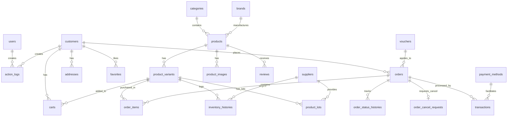

# OmniCommerce — Database Schema Map

> **Mục đích:** Tài liệu này cung cấp sơ đồ quan hệ thực thể (ERD) và danh sách các trường/quan hệ cốt lõi của 25+ bảng trong cơ sở dữ liệu MySQL của OmniCommerce. 
> Bất kỳ AI Agent hoặc Developer nào cần viết query, viết migration mới hoặc tối ưu hóa database đều **BẮT BUỘC** phải đọc file này trước để nắm rõ cấu trúc, tránh việc đọc 60+ file migration gây lãng phí token.

---

## 📊 1. Sơ đồ Quan hệ Thực thể (ERD - Entity Relationship Diagram)

---

## 🗃️ 2. Chi tiết các bảng cốt lõi (Core Tables Detail)

### 👥 Người dùng & Khách hàng

#### 1. Bảng `users` (Quản trị viên & Nhân viên)
- **Mục đích:** Lưu trữ thông tin đăng nhập của Admin và Staff. Phân quyền chi tiết thông qua `spatie/laravel-permission` (các bảng `roles`, `permissions`, `model_has_roles`...).
- **Các trường chính:**
  - `id` (PK)
  - `name` (string)
  - `email` (string, unique)
  - `password` (string)
  - `status` (enum/string: active, inactive)
  - `department` (string, 100, nullable - tên phòng ban)
  - `position` (string, 100, nullable - chức vụ)
  - `hire_date` (date, nullable - ngày vào làm)
  - `base_salary` (decimal 15,2, default: 0 - lương cứng)
  - `commission_rate` (decimal 5,2, default: 0 - % hoa hồng chốt đơn)
  - `created_at`, `updated_at`

#### 2. Bảng `customers` (Khách hàng cuối)
- **Mục đích:** Phân tách hoàn toàn với `users` (Admin). Sử dụng guard `customer`.
- **Các trường chính:**
  - `id` (PK)
  - `name` (string)
  - `email` (string, unique)
  - `phone` (string, nullable)
  - `password` (string, nullable - cho phép null nếu đăng nhập qua OAuth)
  - `provider`, `provider_id` (string, nullable - đăng nhập Socialite Google/Facebook)
  - `avatar` (string, nullable)
  - `status` (string, active/blocked)
  - `created_at`, `updated_at`, `deleted_at` (SoftDeletes)

---

### 🛍️ Sản phẩm & Thuộc tính

#### 1. Bảng `products` (Sản phẩm cha)
- **Mục đích:** Lưu trữ thông tin chung của sản phẩm (không bao gồm biến thể).
- **Các trường chính:**
  - `id` (PK)
  - `category_id` (FK -> `categories.id`)
  - `brand_id` (FK -> `brands.id`, nullable)
  - `name` (string)
  - `slug` (string, unique)
  - `description` (longText, nullable)
  - `thumbnail` (string, nullable)
  - `specifications` (json, nullable - lưu thông số kỹ thuật động)
  - `views_count` (unsignedBigInteger, default: 0)
  - `status` (string: active, draft, inactive)
  - `created_at`, `updated_at`, `deleted_at`

#### 2. Bảng `product_variants` (Biến thể Sản phẩm)
- **Mục đích:** Lưu trữ từng biến thể cụ thể. Tất cả các giao dịch mua bán và tồn kho đều làm việc trực tiếp với ID của bảng này.
- **Các trường chính:**
  - `id` (PK)
  - `product_id` (FK -> `products.id`)
  - `sku` (string, unique)
  - `price` (decimal, 15,2)
  - `compare_at_price` (decimal, 15,2, nullable)
  - `stock` (integer, default: 0 - bắt buộc dùng lockForUpdate khi thay đổi)
  - `attribute_values` (json, nullable)
  - `created_at`, `updated_at`, `deleted_at`

---

### 📦 Kho Bãi & Lô Hàng [NEW]

#### 1. Bảng `suppliers` (Nhà cung cấp)
- **Mục đích:** Lưu giữ thông tin đối tác cung ứng hàng hóa cho hệ thống.
- **Các trường chính:**
  - `id` (PK)
  - `code` (string, unique, VD: `NCC-0001`)
  - `name` (string - tên nhà cung cấp)
  - `phone`, `email`, `address` (string, nullable)
  - `description` (text, nullable)
  - `is_active` (boolean, default 1)
  - `created_at`, `updated_at`, `deleted_at`

#### 2. Bảng `product_lots` (Lô hàng nhập kho - FIFO)
- **Mục đích:** Quản lý số lượng tồn kho và hạn sử dụng của từng đợt hàng nhập cụ thể cho các SKU. Trừ kho theo phương pháp FIFO.
- **Các trường chính:**
  - `id` (PK)
  - `product_variant_id` (FK -> `product_variants.id`)
  - `supplier_id` (FK -> `suppliers.id`, nullable)
  - `lot_number` (string - mã số lô hàng)
  - `expiry_date` (date, nullable - hạn sử dụng của lô)
  - `quantity` (integer - số lượng tồn kho còn lại trong lô)
  - `initial_quantity` (integer - số lượng nhập kho ban đầu)
  - `created_at`, `updated_at`

#### 3. Bảng `inventory_histories` (Lịch sử Kho bãi - Cập nhật)
- **Các trường mới bổ sung:**
  - `supplier_id` (FK -> `suppliers.id`, nullable)
  - `lot_number` (string, nullable)
  - `expiry_date` (date, nullable)

---

### 🛒 Giỏ hàng, Mã giảm giá & Đơn hàng

#### 1. Bảng `carts`
- **Mục đích:** Lưu giỏ hàng database của khách hàng đã đăng nhập.
- **Các trường chính:**
  - `id` (PK)
  - `customer_id` (FK -> `customers.id`)
  - `product_variant_id` (FK -> `product_variants.id`)
  - `quantity` (integer)
  - `price` (decimal 15,2)
  - `created_at`, `updated_at`

#### 2. Bảng `vouchers` (Mã giảm giá)
- **Các trường chính:**
  - `id` (PK)
  - `code` (string, unique)
  - `name` (string)
  - `type` (string: percent, fixed)
  - `value` (decimal 15,2)
  - `min_order_value` (decimal 15,2, default: 0)
  - `max_discount` (decimal 15,2)
  - `quantity` (integer)
  - `limit_per_user` (integer)
  - `start_date`, `end_date` (datetime)
  - `is_active` (boolean)
  - `created_at`, `updated_at`

#### 3. Bảng `orders` & `order_items`
- **Bảng `orders` (Cập nhật cột VAT):**
  - `id` (PK)
  - `order_code` (string, unique - Mã đơn hàng, VD: ORD-XXXX)
  - `vat_invoice_number` (string, nullable - Số hóa đơn điện tử 7 chữ số, VD: `0000125`)
  - `vat_invoice_serial` (string, nullable - Ký hiệu hóa đơn, VD: `AA/22E`)
  - `vat_invoice_template` (string, nullable - Ký hiệu mẫu hóa đơn, VD: `01GTKT0/001`)
  - `customer_id` (FK -> `customers.id`, nullable)
  - `name`, `phone`, `address` (string)
  - `shipping_fee` (decimal 15,2)
  - `subtotal` (decimal 15,2)
  - `tax_amount` (decimal 15,2, default 0 - Số tiền thuế VAT 10% inclusive)
  - `discount_amount` (decimal 15,2)
  - `grand_total` (decimal 15,2)
  - `status` (string)
  - `payment_status` (string)
  - `payment_method` (string)
  - `created_at`, `updated_at`
- **Bảng `order_items`:**
  - `id` (PK)
  - `order_id` (FK -> `orders.id`)
  - `product_id` (FK -> `products.id`)
  - `variant_id` (FK -> `product_variants.id`)
  - `quantity` (integer)
  - `price` (decimal 15,2)
  - `total_price` (decimal 15,2)

---

## 🪵 Cấu hình & Nhật ký

#### 1. Bảng `settings` (Bổ sung metadata công ty)
- **Mục đích:** Lưu cấu hình Key-Value. Hỗ trợ lưu trữ thông tin công ty bán hàng, mã số thuế, hotline, email doanh nghiệp cho VAT.

#### 2. Bảng `action_logs`
- **Các trường chính:**
  - `id` (PK)
  - `user_id` (FK -> `users.id`, nullable - Quản trị viên/nhân viên thao tác)
  - `customer_id` (FK -> `customers.id`, nullable - Khách hàng tự thao tác hoặc thực thể liên quan tới khách hàng)
  - `action` (string)
  - `loggable_type` (string, VD: `App\Models\Product`)
  - `loggable_id` (unsignedBigInteger)
  - `old_values` (json, nullable)
  - `new_values` (json, nullable)
  - `ip_address` (string, nullable)
  - `user_agent` (text, nullable)
  - `created_at`

### 💵 Nhân sự & Tính lương

#### 1. Bảng `payroll_records` (Bảng tính lương tháng)
- **Mục đích:** Lưu trữ chi tiết lịch sử tính lương, hoa hồng đơn chốt và thưởng KPI.
- **Các trường chính:**
  - `id` (PK)
  - `user_id` (FK -> `users.id`)
  - `period_month` (tinyint)
  - `period_year` (smallint)
  - `base_salary` (decimal 15,2)
  - `commission_amount` (decimal 15,2)
  - `bonus_amount` (decimal 15,2)
  - `deductions` (decimal 15,2)
  - `net_salary` (decimal 15,2)
  - `paid_at` (timestamp, nullable)
  - `created_by` (FK -> `users.id`)
  - `created_at`, `updated_at`
